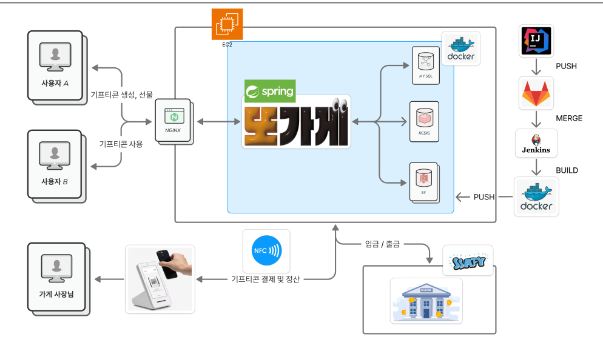

 

## 📌 목차
1. [프로젝트 소개](#-프로젝트-소개)
2. [팀 소개](#dddd)
3. [주요 기능](#-주요-기능)
4. [시연 영상](#-시연-영상)
5. [주요 기술](#-주요-기술)
6. [기술 아키텍처](#-기술-아키텍처처)
7. [프로젝트 구조](#-프로젝트-구조)
8. [산출물](#-산출물)
    

## 🚀 프로젝트 소개

***SSAFY 12기 2학기 공통 프로젝트***

> ⌛ 프로젝트 기간 : 2025.02.28 ~ 2025.04.11 (6주)

> 📆 상세 기간 : 기획 2주 + 개발 3주 + 버그 해결 1주

> 🔗 [노션 링크](https://relic-sea-1e3.notion.site/1a412a0174e780b4870bd63cd477cac6)

> 📲 [배포 URL - 모바일]()

### 🏃"친구와 함께 달리는 RPG, 로캣냥(roCatRun)!"
**✨ 혼자 하는 러닝은 이제 그만!** 
지루한 러닝이 실시간 레이드 게임으로 다시 태어났어요. 
친구들과 함께 보스를 물리치며 즐거운 러닝을 시작해보세요! 

**🎮 이런 분들을 위한 러닝 게임이에요** 
혼자 뛰기는 심심하고 동기부여가 필요하신 분 
친구들과 함께 목표를 달성하며 운동하고 싶으신 분 
러닝을 더 재미있게 즐기고 싶으신 분 
갤럭시 워치로 건강한 습관을 만들고 싶으신 분 

**😻 로캣냥만의 특별한 기능** 
실시간으로 친구와 함께하는 보스 레이드 
달리면서 쌓이는 공격게이지로 짜릿한 보스 처치 
러닝 후 받은 코인으로 귀여운 캐릭터 꾸미기 
일별/주별/월별 상세한 러닝 통계 

**💪 이렇게 사용해보세요!** 
1️⃣ 친구를 초대하거나 랜덤 매칭으로 파티 구성 
2️⃣ 함께 달리며 실시간으로 공유되는 러닝 현황 확인 
3️⃣ 보스를 물리치고 획득한 코인으로 캐릭터 꾸미기 
4️⃣ 레벨업하고 랭킹에서 나만의 기록 달성하기 

## 👥 팀 소개
<table style="text-align: center;" width="100%">
  <tr>
    <th style="text-align: center;" width="16.66%"></th>
    <th style="text-align: center;" width="16.66%"></th>
    <th style="text-align: center;" width="16.66%"></th>
    <th style="text-align: center;" width="16.66%"></th>
    <th style="text-align: center;" width="16.66%"></th>
    <th style="text-align: center;" width="16.66%"></th>
  </tr>
  <tr>
    <td style="text-align: center;" width="16.66%">천세윤 <a href="https://github.com/yooniverse7">@yooniverse7</a></td>
    <td style="text-align: center;" width="16.66%">민상기 <a href="https://github.com/Steadystudy">@Steadystudy</a></td>
    <td style="text-align: center;" width="16.66%">정영한 <a href="https://github.com/ynghan">@ynghan</a></td>
    <td style="text-align: center;" width="16.66%">이상혁 <a href="https://github.com/leesanghyeok523">@leesanghyeok523</a></td>
    <td style="text-align: center;" width="16.66%">최진문 <a href="https://github.com/jinmoon23">@jinmoon23</a></td>
    <td style="text-align: center;" width="16.66%">신주환 <a href="https://github.com/yurai770">@yurai770</a></td>
  </tr>
  <tr>
    <td style="text-align: center;" width="16.66%">백엔드 개발   (팀장)</td>
    <td style="text-align: center;" width="16.66%">프론트 개발</td>
    <td style="text-align: center;" width="16.66%">인프라 개발</td>
    <td style="text-align: center;" width="16.66%">백엔드 개발</td>
    <td style="text-align: center;" width="16.66%">프론트 개발</td>
    <td style="text-align: center;" width="16.66%">백엔드 개발</td>
  </tr>
  <tr>
    <td style="text-align: center;" width="16.66%">결제 API, NFC 기능, </td>
    <td style="text-align: center;" width="16.66%">지도 및 NFC, QR 결제 담당</td>
    <td style="text-align: center;" width="16.66%">인프라 CI/CD 구축, 기프티콘 API, 지라 관리</td>
    <td style="text-align: center;" width="16.66%">맛집 API, 크롤링, Redis, S3, 소셜로그인, AI 서빙 (Stable diffusion)</td>
    <td style="text-align: center;" width="16.66%">React-Native 관련 통신 및 기프티콘 생성, 마이페이지 담당</td>
    <td style="text-align: center;" width="16.66%">NFC 기능, Spring Security, POS 기기 구현</td>
  </tr>
</table>

## 🚀 주요 기능

<strong>로그인, 메인 페이지, 랭킹, 유저프로필</strong>

<table style="text-align: center;" width="100%">
  <tr>
    <th style="text-align: center;" width="25%">소셜 로그인</th>
    <th style="text-align: center;" width="25%">유저 정보 입력</th>
    <th style="text-align: center;" width="25%">코칭마크 페이지</th>
    <th style="text-align: center;" width="25%">메인 페이지</th>
  </tr>
  <tr>
    <td style="text-align: center;" width="25%"></td>
    <td style="text-align: center;" width="25%"></td>
    <td style="text-align: center;" width="25%"></td>
    <td style="text-align: center;" width="25%"></td>
  </tr>
  <tr>
    <td style="text-align: center;" width="25%">카카오, 네이버, 구글 3가지의 소셜 회원가입/로그인 기능을 제공합니다.</td>
    <td style="text-align: center;" width="25%">회원가입을 한 신규 유저는 게임에서 사용할 닉네임, 칼로리 계산을 위한 신체 정보를 입력할 수 있습니다.</td>
    <td style="text-align: center;" width="25%">코칭 마크를 통해 각 버튼의 기능을 소개합니다. (Skip으로 바로 메인페이지로 이동 가능)</td>
    <td style="text-align: center;" width="25%">자신의 캐릭터 위의 닉네임을 누르면 세계관 스토리와 소개페이지를 다시 볼 수 있습니다.   자신의 캐릭터 고양이를 누르면 랜덤 메세지가 뜨게 됩니다.</td>
  </tr>
</table>

<table style="text-align: center;" width="100%">
  <tr>
    <th style="text-align: center;" width="50%">유저 프로필 모달</th>
    <th style="text-align: center;" width="50%">랭킹 모달</th>
  </tr>
  <tr>
    <td style="text-align: center;" width="50%"></td>
    <td style="text-align: center;" width="50%"></td>
  </tr>
  <tr>
    <td style="text-align: center;" width="50%">유저정보 모달에서 정보 수정 터치 시 닉네임, 신체 정보를 수정가능하며   중복, 입력 검사 완료시 저장 버튼이 활성화됩니다.   하단에는 회원탈퇴 로그아웃 버튼도 위치해있습니다.</td>
    <td style="text-align: center;" width="50%">랭킹 모달에서는 유저들의 순위를 볼 수 있습니다.   자신의 순위는 상단에 고정되며 각 플레이어의 프로필 사진도 확인 가능합니다.</td>
  </tr>
</table>

<strong>통계 페이지, 옷장 페이지, 판매 페이지</strong>

<table style="text-align: center;" width="100%">
  <tr>
    <th style="text-align: center;" width="33.33%">통계 페이지 (일별)</th>
    <th style="text-align: center;" width="33.33%">통계 페이지 (세부)</th>
    <th style="text-align: center;" width="33.33%">통계 페이지 (주별)</th>
  </tr>
  <tr>
    <td style="text-align: center;" width="33.33%"></td>
    <td style="text-align: center;" width="33.33%"></td>
    <td style="text-align: center;" width="33.33%"></td>
  </tr>
  <tr>
    <td style="text-align: center;" width="33.33%">일/주/월 페이지는 탭을 터치하거나 슬라이드를 통해 넘어갈 수 있습니다.   일별 데이터는 모든 기록이 최근순으로 보여집니다.</td>
    <td style="text-align: center;" width="33.33%">일별 데이터 중 개인 기록 터치 시, 해당 일자에 달린 상세 정보가 모달로 나타납니다.</td>
    <td style="text-align: center;" width="33.33%">주/월의 경우 날짜를 선택할 수 잇는 모달이 있습니다.</td>
  </tr>
</table>

<table style="text-align: center;" width="100%">
  <tr>
    <th style="text-align: center;" width="25%">아이템 뽑기 결과 모달</th>
    <th style="text-align: center;" width="25%">옷장 페이지</th>
    <th style="text-align: center;" width="25%">아이템 설명 모달</th>
    <th style="text-align: center;" width="25%">판매 페이지</th>
  </tr>
  <tr>
    <td style="text-align: center;" width="25%"></td>
    <td style="text-align: center;" width="25%"></td>
    <td style="text-align: center;" width="25%"></td>
    <td style="text-align: center;" width="25%"></td>
  </tr>
  <tr>
    <td style="text-align: center;" width="25%">뽑기 버튼을 누르게 되면 100 캔코인이 차감되며, 확률에 의해 아이템이 뜨게됩니다.</td>
    <td style="text-align: center;" width="25%">뽑기를 통해 수집된 아이템들을 확인할 수 있습니다.   (중복된 아이템은 보이지 않습니다.) 항목별 아이템은 1개씩 착용 가능합니다.</td>
    <td style="text-align: center;" width="25%">아이템 사진을 누르게 되면 해당 아이템에 관련된 정보를 볼 수 있습니다.   (모달창 색은 등급별로 다르게 나타납니다)</td>
    <td style="text-align: center;" width="25%">상점에서 자신이 소지한 아이템을 선택하여 판매할 수 있습니다.   (장착중인 아이템은 선택할 수 없습니다.)</td>
  </tr>
</table>

<strong>게임 페이지</strong>

<table style="text-align: center;" width="100%">
  <tr>
    <th style="text-align: center;" width="25%">게임 페이지</th>
    <th style="text-align: center;" width="25%">게임 규칙 모달</th>
    <th style="text-align: center;" width="25%">방 생성 화면</th>
    <th style="text-align: center;" width="25%">대기 화면</th>
  </tr>
  <tr>
    <td style="text-align: center;" width="25%"></td>
    <td style="text-align: center;" width="25%"></td>
    <td style="text-align: center;" width="25%"></td>
    <td style="text-align: center;" width="25%"></td>
  </tr>
  <tr>
    <td style="text-align: center;" width="25%"> ? 버튼을 누르면 게임 Rule 모달창이 켜지고,   ! 버튼을 누르면 보스 정보 모달창이 켜집니다.</td>
    <td style="text-align: center;" width="25%">게임 Rule 모달창에서 자세한 게임 방법을 볼 수 있습니다.</td>
    <td style="text-align: center;" width="25%">방 만들기 버튼 터치 시, 난이도와 인원을 선택할 수 있습니다.   방 생성 버튼을 터치하면 대기 화면으로 넘어갑니다.</td>
    <td style="text-align: center;" width="25%">생성된 초대코드는 복사 버튼을 통해 복사할 수 있습니다.   현재 인원을 확인할 수 있습니다.</td>
  </tr>
</table>

<table style="text-align: center;" width="100%">
  <tr>
    <th style="text-align: center;" width="33.33%">게임 중 화면</th>
    <th style="text-align: center;" width="33.33%">싱글 결과</th>
    <th style="text-align: center;" width="33.33%">멀티 결과</th>
  </tr>
  <tr>
    <td style="text-align: center;" width="33.33%"></td>
    <td style="text-align: center;" width="33.33%"></td>
    <td style="text-align: center;" width="33.33%"></td>
  </tr>
  <tr>
    <td style="text-align: center;" width="33.33%">모든 인원이 들어오거나, 게임에 입장하게 되면 보이는 화면입니다.   상단에는 선택한 난이도에 해당하는 보스 이미지가 움직이고 있습니다.</td>
    <td style="text-align: center;" width="33.33%">싱글 게임에서 패배한 경우 보이는 결과 모달창입니다.</td>
    <td style="text-align: center;" width="33.33%">멀티 게임에서 승리한 경우 보이는 결과 모달창입니다.   러닝, 게임과 관련된 상세 정보가 보입니다.   슬라이드로 넘기면 플레이어의 순위가 나타납니다.</td>
  </tr>
</table>

<strong>워치 페이지</strong>

<table style="text-align: center;" width="100%">
  <tr>
    <th style="text-align: center;" width="33.33%">워치 시작 페이지</th>
    <th style="text-align: center;" width="33.33%">게임 실행 페이지</th>
    <th style="text-align: center;" width="33.33%">플레이어 현황 페이지</th>
  </tr>
  <tr>
    <td style="text-align: center;" width="33.33%"></td>
    <td style="text-align: center;" width="33.33%"></td>
    <td style="text-align: center;" width="33.33%"></td>
  </tr>
  <tr>
    <td style="text-align: center;" width="33.33%">확인 버튼을 누르면 모바일 앱이 실행됩니다.   (모바일 앱에서만 게임 시작이 가능합니다.)</td>
    <td style="text-align: center;" width="33.33%">5초 카운트다운 후 나타나는 사용자의 실시간 러닝 데이터 화면입니다.</td>
    <td style="text-align: center;" width="33.33%">플레이어들의 실시간 달린 거리, 공격 횟수 표시 화면입니다.</td>
  </tr>
</table>

<table style="text-align: center;" width="100%">
  <tr>
    <th style="text-align: center;" width="33.33%">공격 시 화면</th>
    <th style="text-align: center;" width="33.33%">피버타임 화면</th>
    <th style="text-align: center;" width="33.33%">게임 종료 화면</th>
  </tr>
  <tr>
    <td style="text-align: center;" width="33.33%"></td>
    <td style="text-align: center;" width="33.33%"></td>
    <td style="text-align: center;" width="33.33%"></td>
  </tr>
  <tr>
    <td style="text-align: center;" width="33.33%">사용가능한 공격 아이템이 있다면 공격 버튼이 활성화됩니다.   (공격 시 1초간 진동으로 알림이 발생하고 참치캔이 날라갑니다.)</td>
    <td style="text-align: center;" width="33.33%">모든 플레이어가 2회씩 공격한다면 피버 타임이 시작됩니다.   피버타임은 30초동안 진행되고, 진동이 계속 발생합니다.</td>
    <td style="text-align: center;" width="33.33%">정상적으로 게임이 종료되었을 때 나오는 화면입니다.</td>
  </tr>
</table>

## 🎥 시연 영상
<table style="text-align: center;" width="100%">
  <tr>
    <th style="text-align: center;" width="33.33%">메인페이지 기능 영상</th>
    <th style="text-align: center;" width="33.33%">게임페이지 기능 영상</th>
    <th style="text-align: center;" width="33.33%">통계페이지 영상</th>
  </tr>
  <tr>
    <td style="text-align: center;" width="33.33%"></td>
    <td style="text-align: center;" width="33.33%"></td>
    <td style="text-align: center;" width="33.33%"></td>
  </tr>
</table>

## 🔧 주요 기술

## 🗺️ 기술 아키텍처

## 📂 프로젝트 구조

  
<strong>Back 폴더 구조 보기</strong>

  <pre>
📦 main  
 ┣ 📂 java  
 ┃ ┗ 📂 com  
 ┃   ┗ 📂 example  
 ┃     ┗ 📂 ddo_pay  
 ┃       ┣ 📂 client  
 ┃       ┣ 📂 common  
 ┃       ┃ ┣ 📂 config  
 ┃       ┃ ┃ ┣ 📂 redis  
 ┃       ┃ ┃ ┣ 📂 rest  
 ┃       ┃ ┃ ┣ 📂 S3  
 ┃       ┃ ┃ ┗ 📂 security  
 ┃       ┃ ┃   ┗ 📂 token  
 ┃       ┃ ┣ 📂 dto  
 ┃       ┃ ┣ 📂 exception  
 ┃       ┃ ┣ 📂 response  
 ┃       ┃ ┗ 📂 util  
 ┃       ┣ 📂 gift  
 ┃       ┃ ┣ 📂 controller  
 ┃       ┃ ┣ 📂 dto  
 ┃       ┃ ┃ ┣ 📂 create  
 ┃       ┃ ┃ ┣ 📂 select  
 ┃       ┃ ┃ ┗ 📂 update  
 ┃       ┃ ┣ 📂 entity  
 ┃       ┃ ┣ 📂 repository  
 ┃       ┃ ┗ 📂 service  
 ┃       ┃   ┗ 📂 impl  
 ┃       ┣ 📂 pay  
 ┃       ┃ ┣ 📂 controller  
 ┃       ┃ ┣ 📂 dto  
 ┃       ┃ ┃ ┣ 📂 bank_request  
 ┃       ┃ ┃ ┣ 📂 bank_response  
 ┃       ┃ ┃ ┣ 📂 finance  
 ┃       ┃ ┃ ┣ 📂 request  
 ┃       ┃ ┃ ┗ 📂 response  
 ┃       ┃ ┣ 📂 entity  
 ┃       ┃ ┣ 📂 finance_api  
 ┃       ┃ ┣ 📂 repository  
 ┃       ┃ ┗ 📂 service  
 ┃       ┃   ┗ 📂 impl  
 ┃       ┣ 📂 restaurant  
 ┃       ┃ ┣ 📂 controller  
 ┃       ┃ ┣ 📂 dto  
 ┃       ┃ ┃ ┣ 📂 receipt  
 ┃       ┃ ┃ ┣ 📂 request  
 ┃       ┃ ┃ ┗ 📂 response  
 ┃       ┃ ┣ 📂 entity  
 ┃       ┃ ┣ 📂 mapper  
 ┃       ┃ ┣ 📂 repository  
 ┃       ┃ ┗ 📂 service  
 ┃       ┃   ┣ 📂 crawling  
 ┃       ┃   ┣ 📂 impl  
 ┃       ┃   ┗ 📂 receipt  
 ┃       ┃     ┗ 📂 impl  
 ┃       ┣ 📂 sse  
 ┃       ┗ 📂 user  
 ┃         ┣ 📂 controller  
 ┃         ┣ 📂 dto  
 ┃         ┃ ┣ 📂 request  
 ┃         ┃ ┗ 📂 response  
 ┃         ┣ 📂 entity  
 ┃         ┣ 📂 mapper  
 ┃         ┣ 📂 repo  
 ┃         ┗ 📂 service  
 ┃           ┗ 📂 impl  
 ┗ 📂 resources
   ┗ 📂 application.yml

  </pre>

  
<strong>Front - mobile 폴더 구조 보기</strong>

  <pre>
📁 FE/mobile/src
├─📁 features
│  └─📁 contactServices
│      ├─📁 api
│      └─📁 types
└─📁 shared
    └─📁 utils
  </pre>

  
<strong>Front - web 폴더 구조 보기</strong>

  <pre>
📁 FE/web/src
├─📁 app
│  ├─📁 (BarLayout)
│  │  ├─📁 gift
│  │  │  └─📁 get
│  │  │      └─📁 [id]
│  │  └─📁 me
│  │      ├─📁 info
│  │      │  └─📁 setting
│  │      └─📁 stores
│  └─📁 (NoLayout)
│      ├─📁 callback
│      ├─📁 gift
│      │  └─📁 create
│      ├─📁 login
│      ├─📁 moneyCharge
│      ├─📁 pay
│      │  ├─📁 completed
│      │  └─📁 password
│      ├─📁 permission
│      ├─📁 store
│      │  └─📁 register
│      └─📁 user
│          └─📁 firstLogin
├─📁 components
│  └─📁 ui
├─📁 entity
│  ├─📁 gift
│  │  ├─📁 api
│  │  └─📁 model
│  └─📁 store
│      ├─📁 api
│      └─📁 model
├─📁 features
│  ├─📁 crawledStore
│  │  └─📁 ui
│  ├─📁 favoriteStores
│  │  └─📁 ui
│  ├─📁 giftForm
│  │  ├─📁 api
│  │  └─📁 ui
│  ├─📁 gitfBox
│  │  └─📁 ui
│  ├─📁 kakaoLogin
│  │  ├─📁 api
│  │  └─📁 ui
│  ├─📁 map
│  │  ├─📁 model
│  │  └─📁 ui
│  ├─📁 menuForm
│  │  ├─📁 api
│  │  └─📁 ui
│  ├─📁 myMoneyCheck
│  │  ├─📁 api
│  │  └─📁 ui
│  ├─📁 paymentCheck
│  │  ├─📁 api
│  │  └─📁 ui
│  ├─📁 payPwdForm
│  │  ├─📁 api
│  │  └─📁 ui
│  └─📁 permissonRequest
│      └─📁 api
├─📁 lib
├─📁 shared
│  ├─📁 api
│  ├─📁 constants
│  ├─📁 hooks
│  ├─📁 modal
│  ├─📁 msw
│  │  └─📁 mock
│  │      ├─📁 data
│  │      └─📁 handlers
│  ├─📁 reactQuery
│  └─📁 utils
├─📁 store
├─📁 types
└─📁 widgets
    ├─📁 bottomBar
    │  └─📁 ui
    ├─📁 fadeUpContainer
    │  └─📁 ui
    └─📁 searchBar
        └─📁 ui
  </pre>

## 📜 산출물

  
<strong>기능 명세서</strong>

  <h3>🔹 소셜 로그인</h3>
  
  <h3>🔹 메인페이지</h3>
  
  <h3>🔹 게임 - 레이드</h3>
  
  <h3>🔹 통계/옷장/마이페이지</h3>
  

  
<strong>erd</strong>

  

  
<strong>피그마</strong>

  
  
  
  

  
<strong>api 명세서</strong>

  <h3>🔹 소셜 로그인</h3>
  
  <h3>🔹 마이페이지</h3>
  
  
  <h3>🔹 레이드</h3>
  
  <h3>🔹 매칭</h3>
  
  <h3>🔹 아이템</h3>
  
  <h3>🔹 통계</h3>
  
  <h3>🔹 캐릭터 정보(메인)</h3>
  
  <h3>🔹 S3 이미지 업로드</h3>
  

